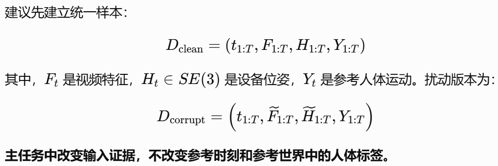

# ICCV2027

# 核心问题

本面向第一视角视频与头部轨迹存在局部失真、漂移和时间错位时的三维人体运动重建。我们利用历史身体状态为当前重建提供时序上下文，并通过局部输入干预生成不同条件使用方式下的候选运动。结合输入证据、历史来源信息以及候选之间的部位—时间结构化响应，学习各处理动作对重建误差的收益，从而选择当前输出并更新历史。为避免错误预测持续约束后续重建，进一步允许解除不可靠的预测历史约束；当历史反馈具有显著影响时，采用有限时域后续重建代价监督选择。第一版冻结生成器，重点验证历史、干预响应与收益选择对鲁棒重建的实际贡献。


# 构建错配数据集

- 时间错位 模拟延迟

- 轨迹漂移：平移或旋转

- 局部失真

    - 轨迹抖动跳变

    - 视频特征缺失或冻结不动


## 数据集选择

- EE4D\-Motion

    - 直接处理DINOv2特征

- NymeriaPlus


## 参考论文

- MultiCorrupt: A Multi\-Modal Robustness Dataset and Benchmark of LiDAR\-Camera Fusion for 3D Object Detection — IEEE IV 2024

- Scalable Benchmarking and Robust Learning for Noise\-Free Ego\-Motion and 3D Reconstruction from Noisy Video — ICLR 2025

- EgoForce: Robust Online Egocentric Motion Reconstruction via Diffusion Forcing — 2026 年 5 月预印本


## 数据集定义



### 时间错位


- 固定相对延迟：一个模态固定向后移动 kk 帧

- 局部突发延迟：仅某个时间区间出现滞后

### 轨迹漂移

- 时变平移或旋转偏差：误差累积变化


- 水平平移和 yaw 漂移

### 局部轨迹失真

- 抖动：小幅度位姿扰动

- 顺势脉冲：一帧或少数帧突然跳变

- 持续跳变

先扰动绝对设备轨迹，再重新计算相对位姿、速度、朝向以及其他派生输入


### 视频特征缺失


合法的缺失标记


### 视频特征冻结


当前场景没有变化

过期特征仍然以正常格式出现


## 强度设置

以 EE4D\-Motion 的 **10 FPS** 协议为基础：

增加：**干净上下文 → 异常输入 → 输入恢复 → 持续观察预测状态。**

> 异常已经结束，错误历史是否还在继续影响后续重建？
> 
> 


## Todo：

1. 组合

2. 长时程故障：整个take

3. 训练和测试分离


## 评测（待完善

### 指标

- 姿态：MPJPE 旋转误差

- 时间和恢复

- 退化量

- 累计误差

### 基线


## 拟定格式

EE4D\-Motion：

```Python
<data_root>/
├── annotations/
│   └── splits.json
├── takes.json
│
├── ee4d_motion/                         # 原始标注版本；首版实验可以不用
│   └── <take_name>/
│       └── ...
│
└── uniegomotion/                        # 你主要使用这一部分
    ├── ee_train.pt                     # 处理后的训练运动序列、Aria 轨迹
    ├── ee_val.pt                       # 处理后的验证运动序列、Aria 轨迹
    ├── egoview_dinov2_train.pt          # 训练集视频特征
    ├── egoview_dinov2_val.pt            # 验证集视频特征
    ├── v4_beta_ee_train_stats.pt        # 运动、轨迹的归一化统计
    └── ee_val_gt_for_evaluation.pkl    # 官方评测参考数据
```

扩展错配数据集：

```Plain Text
<data_root>/
├── uniegomotion/
│   └── ...                         # 官方文件，只读
│
└── ee4d_mismatch_v1/
    ├── spec.json                   # 全局格式、坐标、版本、扰动定义
    ├── train.jsonl                 # 训练样本清单
    ├── val.jsonl                   # 固定验证样本清单
    │
    └── arrays/
        ├── <variant_id_001>.npz
        ├── <variant_id_002>.npz
        └── ...
```

一个variant\_id表示 **某条原始 sequence，在某一套固定扰动参数下的版本。**

### `spec.json`：定义公共约定


### `train.jsonl` / `val.jsonl`：每条记录描述一个损坏版本

```JSON
{
  "variant_id": "example_delay_freeze_s2_seed42",
  "base_split": "val",
  "base_seq_name": "<existing_sequence_name>",
  "array_file": "arrays/example_delay_freeze_s2_seed42.npz",
  "seed": 42,
  "index_unit": "sequence_motion_index_10fps",
  "interval_convention": "[start,end)",
  "operations": [
    {
      "type": "video_delay",
      "start": 10,
      "end": 70,
      "lag_motion_steps": 3
    },
    {
      "type": "video_freeze",
      "start": 30,
      "end": 40,
      "reference": "previous_observed_feature"
    }
  ]
}
```

### `.npz`：存实际数组和索引


```Plain Text
① 数据构建
官方数据
    ↓ 注入延迟、漂移、抖动、缺失或冻结
保存 manifest + 损坏轨迹 + 来源索引
    ↓
到这里，错配数据集就已经构建完成了。


② 数据加载与模型接入
官方数据 + 保存的错配数据
    ↓ Dataset wrapper 读取、取窗口、转换表示
UniEgoMotion 所需的输入与干净监督
```


# 处理方法


